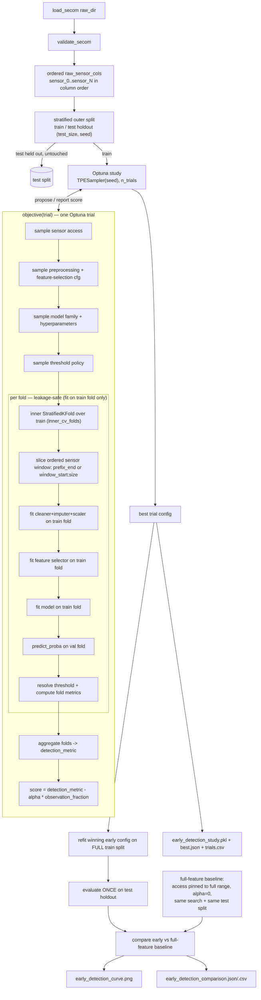

# SDD Spec: Early-Detection Bayesian Optimization for SECOM

> **Umbrella design doc.** Implemented as three slices, each its own spec:
> - **A** — leakage-safe scoring core (no Optuna):
>   [`2026-06-12-early-detection-a-scoring-core.md`](2026-06-12-early-detection-a-scoring-core.md) ← build + verify first
> - **B** — Optuna search, CLI, study artifacts (wraps A) — *to be drafted*
> - **C** — full-feature baseline, comparison, early-detection curve — *to be drafted*

## Goal

Add an isolated experiment that treats ordered SECOM sensor columns as a
fabrication-progress proxy and uses **Optuna** Bayesian optimization to find the
earliest sensor *prefix* or contiguous *window* that still detects failures
well — not the single best model on all sensors. Deliver a study that jointly
searches sensor access, preprocessing, feature selection, model family,
hyperparameters, and threshold under a leakage-safe nested-CV protocol, then
compares the winning early configuration against a full-feature baseline on one
held-out test split.

## Assumption

This experiment **asserts raw SECOM column order as a stand-in for
sensor-acquisition / fabrication progress** — a declared modeling choice, not a
property of the data (sensors are anonymized with no stage/order metadata;
`reports/data_card.md`). "Earliness" means earlier *in column order*; report
results with this caveat.

## Key choices (these resolve real ambiguities — the rest is left to the implementer)

- **BO library: Optuna** (`TPESampler`). The `objective(trial)` pseudocode
  assumes it, and the search space is conditional/categorical (which GP-based BO
  handles poorly). Add `"optuna>=3.6"` to `pyproject.toml` and a `optuna.*`
  mypy override. *(Used in Spec B, not Spec A.)*
- **Outer protocol = single stratified train/test holdout** (`cfg.run.test_size`,
  `cfg.run.random_seed`), **not** k-fold outer CV — the original brief was
  contradictory here. The study runs on the train split; the test split is
  touched once, for the final comparison.
- **Isolated, additive only.** MUST NOT modify the tabular pipeline modules,
  `evaluate.ClassificationMetrics`, existing scripts, or any existing artifact
  in `models/` or `reports/`.

## New files (repo-relative)

- `src/yield_risk/early_detection.py` — search space, objective, nested-CV fold
  loop, refit/evaluate, baseline + comparison, early-detection curve data.
- `scripts/run_early_detection.py` — CLI entry point.
- `configs/early_detection_config.yaml` — committed defaults (below).
- `tests/test_early_detection.py`.
- `docs/early_detection.md` — usage + interpretation.

**Dev contract (all new files):** `from __future__ import annotations`;
Google-style docstrings with Args/Returns/Raises; full annotations; `mypy
--strict` clean; ruff `E,F,W,I,UP,ANN` @ line length 88.

## Reuse (do not reimplement)

- `yield_risk.data.load_secom`, `yield_risk.validation.validate_secom`.
- Cleaning decisions from `yield_risk.preprocess`: `drop_high_missing`,
  `impute_median`, `drop_low_variance`, `drop_high_correlation`. Do **not** call
  `run_preprocessing` (it materializes CSVs); apply these fold-locally so every
  fit statistic comes from the train fold only.
- `yield_risk.evaluate.compute_metrics` for `roc_auc`/`pr_auc`, and its plot
  helpers for figures.
- `yield_risk.config.load_config` for paths/run params; `load_cost_config` only
  when `detection_metric == "neg_expected_cost"`.

## Implementation trace



## Deliverables

### 1. Sensor access (progress proxy)
- `raw_sensor_cols` = columns starting `sensor_`, **in raw DataFrame column
  order** (this order is the progress axis). `n_sensors = len(raw_sensor_cols)`,
  never hard-coded.
- Sampled params:
  - `access_type ∈ {"prefix", "window"}` (categorical).
  - `prefix` → `prefix_end ∈ [1, n_sensors]` (int); window = first `prefix_end`
    columns.
  - `window` → `window_start ∈ [0, n_sensors-1]`, `window_size ∈
    [min_window_size, max_window_size]`; window = `window_start : window_start +
    window_size`, end clipped to `n_sensors`.
- `latest_index(access)`: prefix → `prefix_end`; window → `min(window_start +
  window_size, n_sensors)`.
- `observation_fraction = latest_index(access) / n_sensors ∈ (0, 1]`.

### 2. Preprocessing + feature selection (fit inside each fold only)
- Sampled: `missing_threshold`, `variance_threshold`, `correlation_threshold`
  (floats, ranges from config); `selection_method ∈ {"none", "univariate",
  "mutual_info", "model_importance"}`; conditional `max_features` **or**
  `selection_quantile` (only one, gated by method).
- Per fold on the **sliced window** of the train fold: drop high-missing →
  median impute → drop low-variance → drop high-correlation → `StandardScaler`
  → feature selector. All statistics fit on the train fold; applied to the val
  fold.

### 3. Model family + hyperparameters
- `model_family ∈ {"logistic_regression", "random_forest", "xgboost",
  "lightgbm"}` (categorical; `xgboost`/`lightgbm` already in deps).
- Conditional per-family hyperparameters (ranges in config):
  - logistic_regression: `C`, `penalty`, `class_weight`.
  - random_forest: `n_estimators`, `max_depth`, `min_samples_leaf`,
    `max_features`, `class_weight`.
  - xgboost / lightgbm: `learning_rate`, `n_estimators`, `max_depth`,
    `subsample`, `scale_pos_weight` (default from train-fold class ratio).

### 4. Threshold policy
- `threshold_policy ∈ {"tune", "far_constraint"}`.
  - `"tune"` → `threshold ∈ [0.01, 0.80]` (float), applied to each val fold.
  - `"far_constraint"` → per val fold pick the lowest threshold whose
    false-alarm rate ≤ `false_alarm_rate` (config), maximizing recall.
- Note: PR-AUC and ROC-AUC are threshold-free, so under the default objective
  the threshold does **not** change the trial score; it is still recorded and
  drives reporting and the `recall_at_far` / `neg_expected_cost` objectives.

### 5. Objective
```text
score = detection_metric - alpha * observation_fraction      # MAXIMIZED
```
- `detection_metric ∈ {"pr_auc" (default), "recall_at_far",
  "neg_balanced_error", "neg_expected_cost"}`, aggregated as the **mean across
  inner folds** (folds with undefined metric handled per Edge cases).
- Optuna `study.direction = "maximize"`. Report both the penalized score and
  the raw aggregated detection metric on every trial (via `trial.set_user_attr`).

### 6. Refit + held-out evaluation
- Rebuild the winning config, refit the whole pipeline (cleaning → selection →
  model → threshold) on the **full train split**, evaluate **once** on the test
  holdout. Persist test metrics.

### 7. Full-feature baseline + comparison
- Baseline = the same search procedure with `access_type` pinned to the full
  ordered range (`prefix`, `prefix_end = n_sensors`) and `alpha = 0`, refit on
  the full train split and evaluated on the **same** test holdout. Secondary
  reference: load the existing tabular baseline from
  `reports/model_comparison.json` (selected row) if present, else skip
  gracefully.
- Comparison report covers: PR-AUC, recall at the chosen false-alarm rate,
  balanced accuracy, expected cost, number/fraction of sensors required, and
  latest sensor index needed. Verdict `"early_model_competitive"` when the
  early model is within `performance_tolerance` (config) of the baseline's
  primary metric while using materially fewer sensors; else
  `"baseline_preferred"`; `"no_baseline"` when no reference exists.
- Early-detection curve: primary metric vs `latest_index`, computed by
  evaluating a sweep of prefix lengths (config `curve_prefixes`) with the
  winning non-access settings, plus the full-feature baseline as a horizontal
  reference line → `figures/early_detection_curve.png`.

### 8. Artifacts (namespaced; no collision)
Relative to `cfg.paths`:
- `models_dir / "early_detection_study.pkl"` (joblib-pickled Optuna study),
  `models_dir / "early_detection_best.json"` (winning config + provenance).
- `reports_dir / "early_detection_metrics.json"` (held-out test metrics),
  `reports_dir / "early_detection_comparison.json"` and `... .csv`,
  `reports_dir / "early_detection_trials.csv"` (`study.trials_dataframe()`).
- `figures_dir / "early_detection_curve.png"`.

### 9. Config (`configs/early_detection_config.yaml`, defaults shipped)
```yaml
n_trials: 100
sampler_seed: 42
inner_cv_folds: 5
detection_metric: pr_auc        # pr_auc | recall_at_far | neg_balanced_error | neg_expected_cost
alpha: 0.10                     # earliness penalty weight
access_types: [prefix, window]
min_window_size: 8
max_window_size: 256
model_families: [logistic_regression, random_forest, xgboost, lightgbm]
missing_threshold: [0.2, 0.6]   # [low, high] search bounds
variance_threshold: [1.0e-6, 1.0e-2]
correlation_threshold: [0.85, 0.99]
selection_methods: [none, univariate, mutual_info, model_importance]
max_features: [10, 200]
threshold_policy: tune          # tune | far_constraint
threshold_range: [0.01, 0.80]
false_alarm_rate: 0.10
performance_tolerance: 0.05      # fraction of baseline primary metric
curve_prefixes: [16, 32, 64, 128, 256, 512]
```
Missing file → all defaults (do not raise). Unknown keys → `ValueError` listing
them. CLI `--n-trials`, `--alpha`,
`--detection-metric`, `--seed`, `--config` override individual values.

## Edge cases & gotchas

- **Window/prefix out of range** → clip end to `n_sensors`; `prefix_end` and
  `window_size` sampled within `[1, n_sensors]` / `[min, max]` so a slice is
  always ≥ 1 wide.
- **Zero features survive** preprocessing/selection in a fold → that fold's
  metric is undefined; see infeasible handling below.
- **Single-class val fold** (no positives or no negatives) → `pr_auc` /
  `roc_auc` = `nan` (warn, do not let sklearn raise).
- **Infeasible trial** (every retained-feature count is 0, or fewer than 2
  inner folds produce a defined metric) → objective returns the floor constant
  `EARLY_DETECTION_FLOOR = -1.0` (below any feasible `pr_auc - alpha`), so TPE
  learns to avoid it. Do **not** raise `TrialPruned` (would drop the trial from
  the study and starve the sampler of the negative signal).
- **NaN in raw sensors** → imputed with train-fold medians. **±inf** →
  `ValueError("Sensor matrix contains infinite values")`.
- **`n_sensors == 0`** (no `sensor_` columns) → `ValueError("No raw sensor_
  columns found")`; CLI exits 1.
- **`scale == 0`** zero-variance column after slicing → `StandardScaler` sets
  scale to 1.0 (no div-by-zero); such a column is usually removed by the
  low-variance drop first.
- **xgboost/lightgbm `scale_pos_weight`** defaults to train-fold `n_neg/n_pos`
  unless the sampled value overrides it.
- **Missing `model_comparison.json`** → baseline reference omitted, verdict
  `"no_baseline"`; no exception.
- **Determinism**: `TPESampler(seed=sampler_seed)`, `StratifiedKFold(shuffle=
  True, random_state=cfg.run.random_seed)`, per-model seeds set; two runs with
  the same config produce the same best config and metrics.
- **`nan` in JSON outputs** serialized as `null`.

## Acceptance

- `pyproject.toml` declares `optuna>=3.6` and the mypy override; `ruff` and
  `mypy --strict` pass on all new files.
- An Optuna study runs end-to-end on real SECOM data via
  `scripts/run_early_detection.py` and writes all artifacts in §8 without
  touching any existing tabular artifact.
- Each trial: samples sensor access + preprocessing + feature selection + model
  family + hyperparameters + threshold; runs inner `StratifiedKFold`; fits all
  preprocessing/selection **inside each fold only** (a leakage test asserts a
  fold's transformer statistics depend solely on its train indices).
- The objective returns `detection_metric - alpha * observation_fraction`, and
  reducing `alpha` measurably shifts the winner toward larger
  `observation_fraction` (tested on synthetic data).
- Infeasible/single-class/zero-feature trials return the floor score rather than
  raising (unit-tested).
- The comparison report and early-detection curve are produced, comparing the
  best early model to the full-feature baseline on the identical test holdout,
  with the documented verdict values.
- Tests cover: access sampling + `observation_fraction` math, window clipping,
  fold-local leakage safety, infeasible-trial floor, single-class metric guard,
  config load (defaults / unknown-key raise / CLI override), and artifact
  schema round-trip.
```
